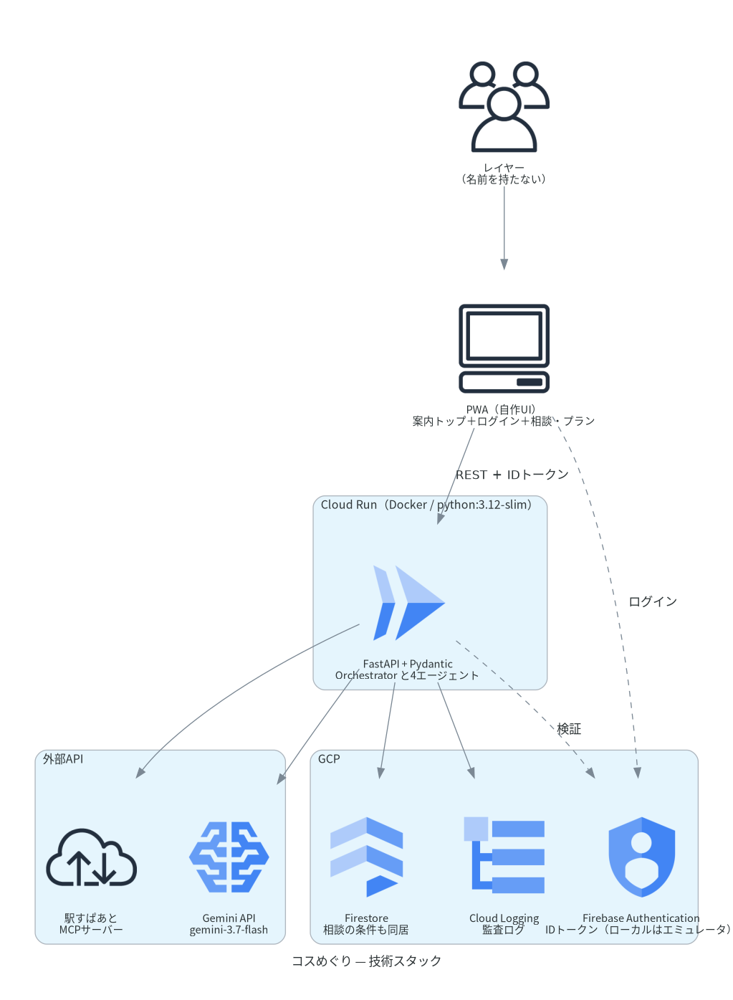
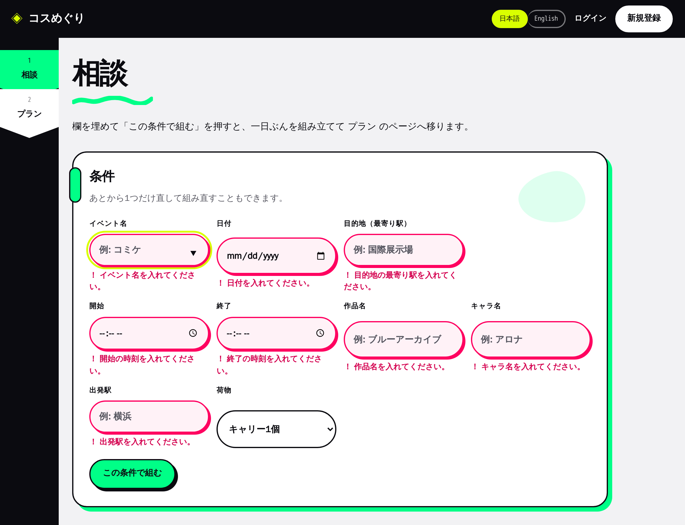
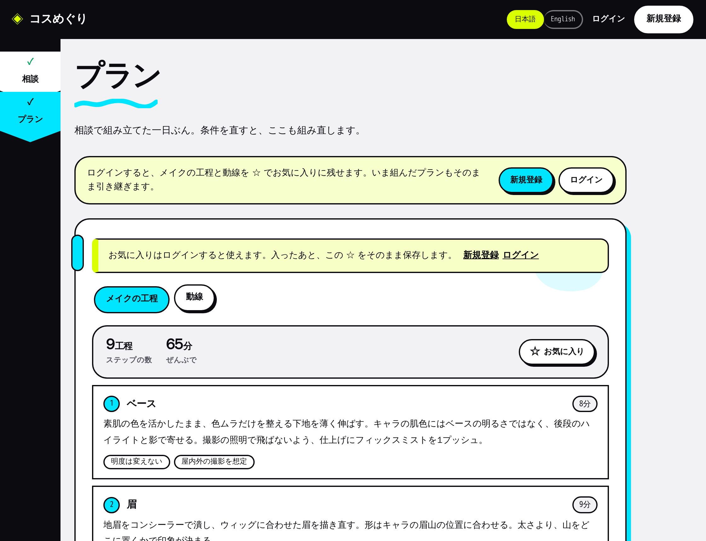
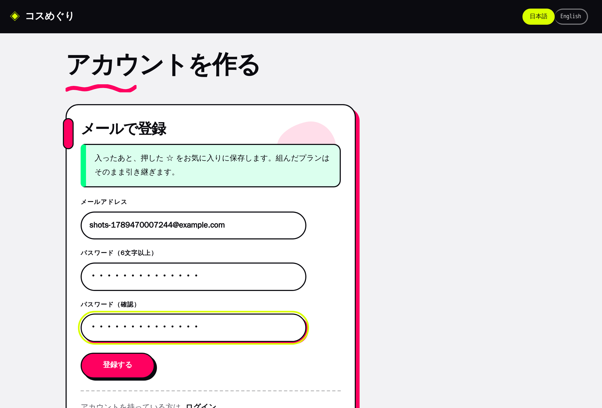
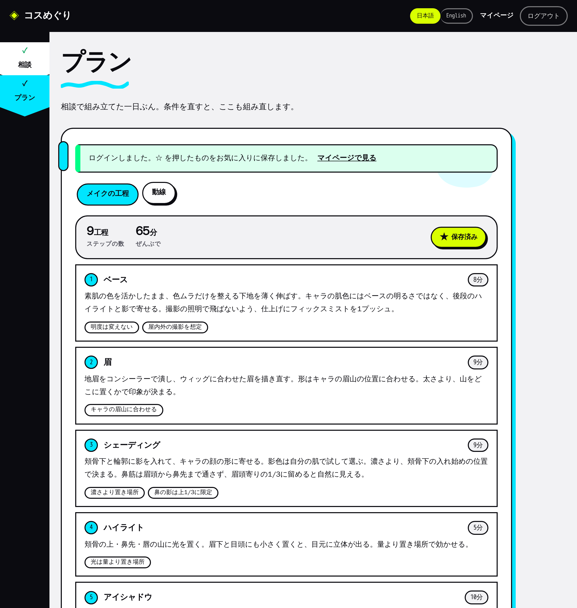
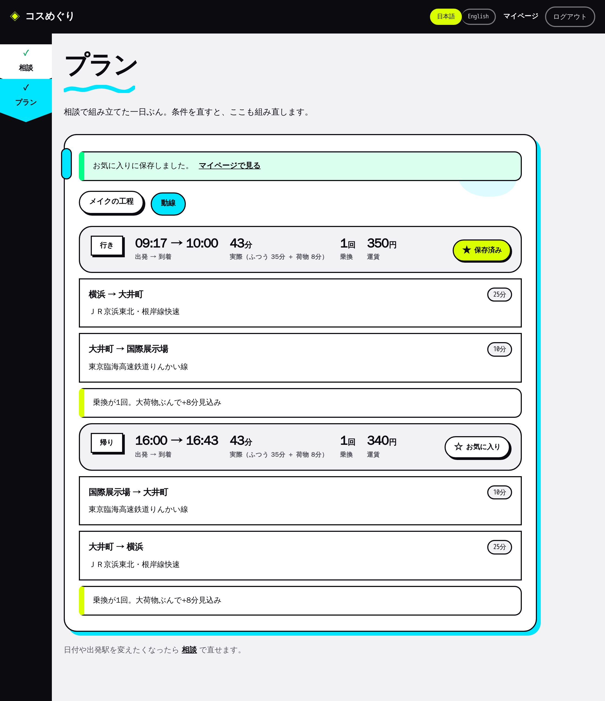
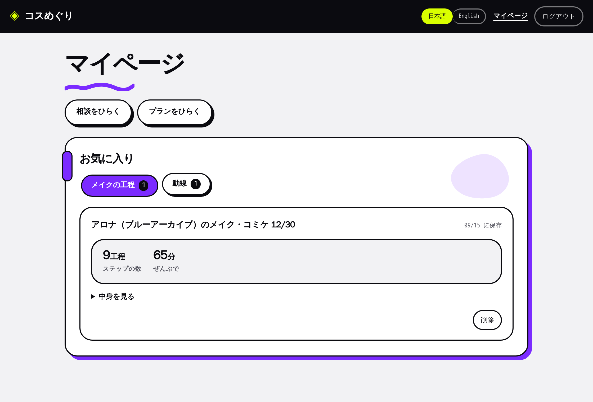
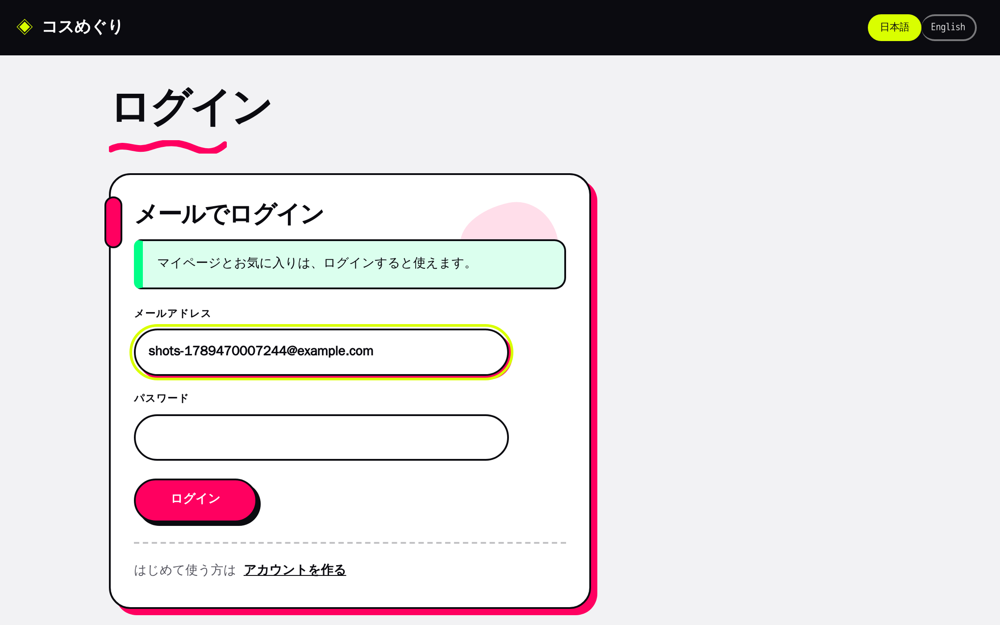

# コスめぐり

**レイヤーの一日エージェント。** コスプレ遠征の一日ぶん（メイクと移動）を、ひとつの相談窓口で組み立てる。

キャラのメイクをどこから始めるか、大荷物でどの経路を使うか。
ばらばらに調べていたことを、相談の欄に入れた条件から一度に出す。
設計の背景と判断は [設計書.md](設計書.md)、開発の手順と決めごとは [CONTRIBUTING.md](CONTRIBUTING.md)、
Cloud Run への載せかたは [DEPLOY.md](DEPLOY.md) を参照。



処理はすべて利用者の操作起点。無人で動く定期実行は持たない。

## 画面

左端のシェブロンで「相談」と「プラン」の2つの節を行き来する。

| ページ | 中身 |
|---|---|
| `/` | できること・使い方。「使ってみる」はログインせずに相談へ入る |
| `/login` | ログイン。メールアドレスとパスワード（ローカルは認証エミュレータ、本番は Firebase Authentication） |
| `/signup` | アカウントを作る。看板の「新規登録」や、ゲストが ☆ を押したときの案内から来る |
| `/ask` | 相談。欄を埋めて「この条件で組む」を押すと、組み上がったプランへ移る |
| `/plan` | メイクの工程・動線。それぞれ ☆ でお気に入りに保存できる（動線は行き・帰りごと） |
| `/me` | マイページ。お気に入りの一覧・中身・削除（ログインした人だけ） |

**ログインしなくても相談とプランは使える。** ログインすると ☆ でお気に入りに残せる（下の「ログインとゲスト」）。

### 画面操作イメージ

`docker compose --profile shots run --rm shots` で、利用者と同じ順に操作して撮り直せる（[docs/shots.js](docs/shots.js)）。

| 1. トップ（「使ってみる」はログインなしで相談へ） | 2. 相談（足りない欄の真下に何を入れるかが出る） |
|---|---|
|  |  |
| **3. プラン（ゲスト）**（☆ を押すと、ログインと登録の案内が出る） | **4. アカウントを作る**（☆ の案内から。組んだプランは引き継ぐ） |
|  |  |
| **5. プラン: メイクの工程**（登録から戻ると、押してあった ☆ が保存されている） | **6. プラン: 動線**（行きは開始までに着き、帰りは終了後に出る） |
|  |  |
| **7. マイページ**（保存したメイクの工程と動線） | **8. ログイン**（ログインせずにマイページを開くと、ここへ送られる） |
|  |  |

## できること

イベント名・日付・目的地（最寄り駅）・開始・終了・作品名・キャラ名・出発駅・荷物を埋めると、一日ぶんを組み立てる。
イベント名は自由に書ける。収載イベント（「コミケ」「ＡＣＯＳＴＡ！」でも当たる）なら目的地と時刻を自動で入れ、書き換えもできる
（日によって時刻が違うときなど）。**収載に無いローカルイベントも、目的地と開始・終了を入れれば組める。**
駅名の欄は、打つと駅すぱあとの正式な駅名を候補に出す（「大宮」→「大宮(埼玉県)」「大宮(京都府)」）。
駅名が引けず目安の経路に落ちたときは、プランにその旨と候補を出し、本物の経路のように見せない。
押したときに足りない欄があれば、その欄の真下に何を入れるかが出る。

- **キャラ再現メイクの手順化** — キャラの髪色・瞳色から、ベースからウィッグ際まで9工程に分ける。
  **肌の明るさ自体を変える指示は出さない**（キャラの色味には光と影で寄せる）。
  顔を見ないので、濃さの判断は利用者に残す
- **大荷物制約の動線** — 乗換のたびに荷物ぶんの時間を足した **体感時間の短い順**で経路を選ぶ。
  駅すぱあとには乗換の余裕を最大にした条件で問い合わせる。行きは開始までに着き、帰りは終了後に出る
- **お気に入り** — メイクの工程と、動線の行き・帰りを、それぞれ ☆ で保存できる。保存した時点の**写し**なので、
  条件を直してプランを組み直しても残る。見出しはキャラ名（作品名）とイベント・日付で、本人にだけ見える。
  マイページで一覧・中身の確認・削除ができる。**お気に入りとマイページはログインした人だけ**
- **ログインとゲスト** — ログインしていない人は、Firebase の匿名ログインで**ゲスト**として相談とプランを使う
  （メールもパスワードも要らない）。看板には常に「ログイン」「新規登録」を出し、プランの頭と ☆ を押したときに
  「ログインすると残せる」ことを案内する。☆ の案内から登録・ログインすると、**ゲストのあいだに組んだ条件とプランを
  本人へ引き継ぎ**、押してあった ☆ もそのまま保存する。ゲストの条件が空のときや、組み上がっていない下書きで
  本人の組み上がったプランを上書きするときは引き継がない
- **多言語** — 看板の「日本語 / English」で、画面の文言・メイクの工程と根拠・経路の注意書き・誤りの言葉まで切り替わる（日英）。
  ログインしていなくても選べ、組み上がったプランは選んだ言語で組み直す。駅名・路線名は駅すぱあとの日本語表記のまま。
  駅名はローマ字（Yokohama）でも、候補が1つに絞れれば引ける

## プライバシー

コミュニティ固有の要求を設計の中心に置いている。

- **アカウントに名前を持たない。** ログインはメールアドレスとパスワードで、メールは Firebase Authentication だけが持つ。
  アプリのデータに残るのは不透明な uid だけで、コス名も本名も素顔も預からない。ゲストは匿名ログインの uid だけ
- **顔写真を受け取る機能そのものが無い。** 撮る導線も、送る経路も持たない
- **位置も受け取らない。** 共有の機能ごと持たない
- **連絡先を持たない。** 通知を送らないので、電話番号も端末トークンもSNSアカウントも預からない
- **キャラ名・作品名はメイク工程の生成と、本人のお気に入りの見出しにだけ使う。** 遠征の応答など、外向きには出さない

## 動かす

```bash
docker compose up api
```

`http://localhost:8080` を開く。**APIキーが1本も無い状態でも一日ぶんのフローが最後まで通る**
（未設定のプロバイダは自動的にモックで動く）。

一緒に2つのエミュレータが立ち上がる。

- **Firebase Authentication エミュレータ**（`localhost:9099`）— ログインの相手。「使ってみる」だけでゲストとして使え、
  看板の「新規登録」で好きなメールアドレスとパスワードを登録すれば入れる。確認メールは送られず、
  アカウントは `docker compose down` で消える。本番と同じ REST を喋るので、ログインのコードは本番と同じ
- **Firestore エミュレータ** — データの保存先。再起動しても残る

セットアップの詳細・テスト・実APIへの差し替えは [CONTRIBUTING.md](CONTRIBUTING.md) を参照。

## 収載イベント

名前を書くと目的地と時刻が自動で入るイベント。ここに無いイベントも、目的地と時刻を入れれば使える。

| イベント | 場所 | 特性 |
|---|---|---|
| 世界コスプレサミット | 名古屋・大須 | 40ヶ国以上、インバウンドの本丸。市街地回遊型 |
| acosta! | 池袋・ハレザ | 高頻度開催。街歩き撮影が中心 |
| コミックマーケット | 東京ビッグサイト | 最大規模。大荷物・帰路混雑 |
| ホココス | 名古屋・栄 | 道路開放型。ロッカーが少ない |

## 現時点の制約

- **更衣室の混雑は扱わない**。実データが無く、イベント規模から見積もった予測しか出せなかったので機能ごと外した
- **当日の遅延には追従しない**。プランは組んだ時点の経路で、運行情報を見て組み直す機能は持たない
- **合わせ（複数人の段取り）は扱わない**。ひとりの一日ぶんだけを組む
- 対応言語は日英。中韓は設定の追加だけで有効になる
- **ゲストのデータは自動では消えない**。ログアウトや端末の変更で持ち主のいなくなったゲストの条件とプランが
  Firestore に残る。期限で消す仕組み（TTL）はまだ持たない
- **ゲストでもプランを組むたびに Gemini と駅すぱあとを呼ぶ**。呼び出しの回数制限はまだ持たない

技術面の未検証事項は [CONTRIBUTING.md の引き継ぎ事項](CONTRIBUTING.md#未検証引き継ぎ事項) にまとめてある。

## 今後の展望

開発中に組み込みを試したが、今回は使わなかった API。どれも「無くても一日ぶんのプランは
成立する」ので外した。提供や契約の条件がそろえば、次の機能として戻せる。
取り下げの経緯は [設計書.md](設計書.md) の §11〜14 にある。

| API | 使わなかった理由 | そろえば足せるもの |
|---|---|---|
| **駅すぱあと 運行情報**（レスキューナウ） | MCP に Tool が無く、REST は契約外で 403 だった | 当日の遅延を見て出発時刻を組み直す。遅れの通知 |
| **駅すぱあと ダイヤ探索**（時刻指定の経路） | 時刻情報のライセンスが契約に無く、平均所要（`plain`）で引いている | 実際の発車時刻で出発を逆算する |
| **YouCam**（Perfect Corp） | 顔属性・顔比率の解析と衣装の試着が契約に無かった（肌タイプ判定だけは疎通した） | ウィッグの髪型・髪色の試着。肌に合わせたメイクの濃さ |
| **GMI Cloud** | 提供が受けられなくなった | 完成イメージの生成、アフタームービー、多言語の音声ガイド |
| **Cloud Scheduler** | 呼び出し元を絞れないバッチ入口を、一般公開の PWA に残したくなかった | 開けていなくても届く当日の通知（Web Push と組み合わせる） |

戻すときは、顔写真・位置・連絡先を**受け取らない**といういまの約束（[プライバシー](#プライバシー)）を
崩さない形を先に決める。YouCam と通知は、そのまま戻すと約束のほうが弱くなる。
