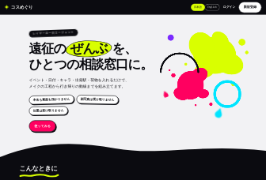
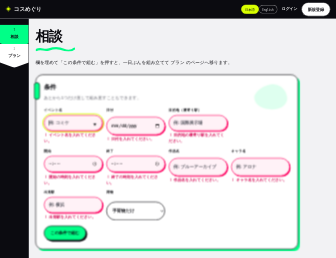
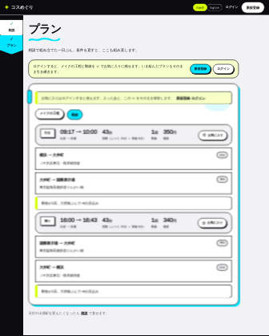
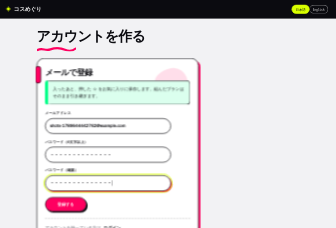
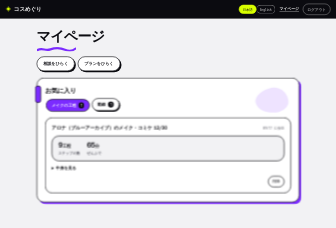

# コスめぐり

**レイヤーの一日エージェント。** コスプレ遠征の一日ぶん（メイクと移動）を、ひとつの相談窓口で組み立てる。

キャラのメイクをどこから始めるか、大荷物でどの経路を使うか。
ばらばらに調べていたことを、相談の欄に入れた条件から一度に出す。

## 画面

左端のシェブロンで「相談」と「プラン」の2つの節を行き来する。

| ページ | 中身 |
|---|---|
| `/` | できること・使い方。 |
| `/login` | ログイン。 |
| `/signup` | アカウントを作る。看板の「新規登録」や、ゲストが ☆ を押したときの案内から来る |
| `/ask` | 相談。欄を埋めて「この条件で組む」を押すと、組み上がったプランへ移る |
| `/plan` | メイクの工程・動線。それぞれ ☆ でお気に入りに保存できる（動線は行き・帰りごと） |
| `/me` | マイページ。お気に入りの一覧・中身・削除（ログインした人だけ） |

**ログインしなくても相談とプランは使える。** ログインすると ☆ でお気に入りに残せる（下の「ログインとゲスト」）。

### 画面操作イメージ

1. **トップ**

   
2. **相談** — 空のまま押すと、足りない欄の真下に何を入れるかが出る。

   
3. **プラン（ゲスト）: メイクの工程** — ☆ を押すと、ログインと登録の案内が出る。

   
4. **プラン（ゲスト）: 動線** — 動線も、ログインする前から見られる。

   
5. **アカウントを作る** — ☆ の案内から来る。組んだプランは引き継ぐ。

   
6. **マイページ** — ログインすると、押した ☆ がお気に入りに並ぶ。

   

## できること

イベント名・日付・目的地（最寄り駅）・開始・終了・作品名・キャラ名・出発駅・荷物を埋めると、一日ぶんを組み立てる。

- **イベント名は自由に書ける。** 収載イベント（「コミケ」「ＡＣＯＳＴＡ！」でも当たる）なら目的地と時刻を自動で入れ、
  書き換えもできる（日によって時刻が違うときなど）。**ローカルイベントも、目的地と開始・終了を入れれば組める**
- **駅名の欄は、打つと駅すぱあとの正式な駅名を候補に出す**（「大宮」→「大宮(埼玉県)」「大宮(京都府)」）
- **駅名が引けず目安の経路に落ちたときは、プランにその旨と候補を出す。** 本物の経路のようには見せない
- **キャラ再現メイクの手順化** — キャラの髪色・瞳色から、ベースからウィッグ際まで9工程に分ける。
- **大荷物制約の動線** — 乗換のたびに荷物ぶんの時間を足した **体感時間の短い順**で経路を選ぶ。
- **お気に入り** — メイクの工程と、動線の行き・帰りを、それぞれ ☆ で保存できる。
- **多言語** — 看板の「日本語 / English」で、画面の文言・メイクの工程と根拠・経路の注意書き・誤りの言葉まで切り替わる（日英）。

## 収録イベント

名前を書くと目的地と時刻が自動で入るイベント。ここに無いイベントも、目的地と時刻を入れれば使える。

| イベント | 場所 | 特性 |
|---|---|---|
| 世界コスプレサミット | 名古屋・大須 | 40ヶ国以上、インバウンドの本丸。市街地回遊型 |
| acosta! | 池袋・ハレザ | 高頻度開催。街歩き撮影が中心 |
| コミックマーケット | 東京ビッグサイト | 最大規模。大荷物・帰路混雑 |
| ホココス | 名古屋・栄 | 道路開放型。ロッカーが少ない |

## 今後の展望

開発中に組み込みを試したが、今回は使わなかった API。どれも「無くても一日ぶんのプランは
成立する」ので外した。提供や契約の条件がそろえば、次の機能として戻せる。

| API | 機能 |
|---|---|
| **駅すぱあと 運行情報**（レスキューナウ） | 当日の遅延を見て出発時刻を組み直す。遅れの通知 |
| **駅すぱあと ダイヤ探索**（時刻指定の経路） | 実際の発車時刻で出発を逆算する |
| **YouCam**（Perfect Corp） | ウィッグの髪型・髪色の試着。肌に合わせたメイクの濃さ |
| **GMI Cloud** | 完成イメージの生成、アフタームービー、多言語の音声ガイド |
| **Cloud Scheduler** | 開けていなくても届く当日の通知（Web Push と組み合わせる） |
